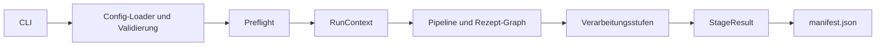
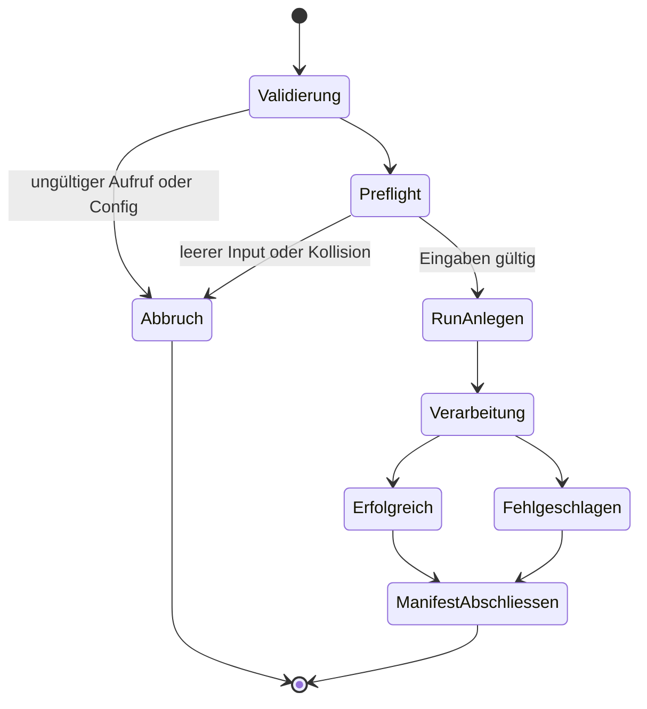

# Architektur

ImagesExtract trennt Bedienung, Konfiguration, Laufzustand und
Bildverarbeitung. Eine Stufe erhält alle benötigten Pfade und Optionen explizit;
kein Modul sucht über das aktuelle Arbeitsverzeichnis nach dem vermeintlich
neuesten Datumsordner.

## Komponenten



| Komponente | Verantwortung |
| --- | --- |
| CLI | Argumente lesen, Meldungen ausgeben und Exitcode setzen |
| Config-Loader | TOML beziehungsweise Legacy-INI einlesen und normalisieren |
| Preflight | Eingaben, Config, Rezepte, Kollisionen und Schreibziele prüfen |
| `RunContext` | unveränderliche Pfade und Laufoptionen eines einzelnen Runs |
| Pipeline | Rezept-Graph auflösen und Stufen in definierter Reihenfolge starten |
| Stufe | genau eine Bildoperation ausführen und `StageResult` zurückgeben |
| Manifest | Eingaben, Konfiguration, Ergebnisse und Fehler atomar dokumentieren |

Interne Stufen werden als Python-Funktionen im selben Prozess aufgerufen. Ein
zusätzlicher Python-Interpreter oder ein implizites Arbeitsverzeichnis ist nicht
Teil des Vertrags.

## Lebenszyklus eines Runs



Der Preflight liegt vor der Run-Erzeugung. Ein leerer Input, eine ungültige
Konfiguration oder eine vorab erkennbare Kollision erzeugt daher keinen neuen
Run und verändert keinen alten.

## RunContext und Pfade

Ein `RunContext` enthält mindestens:

- normalisierten Eingabe- und Ausgabeordner,
- Run-ID und Run-Verzeichnis,
- vollständig validierte Konfiguration,
- Workerzahl,
- die Opt-ins für Überschreiben, Verschieben und Löschen.

Die Ausgabe ist pro Lauf isoliert:

```text
OUTPUT/
└── runs/
    └── RUN_ID/
        ├── working/       # normalisierte PNG/RGBA-Arbeitsdateien
        ├── recipes/       # Ergebnisse der aktivierten Rezepte
        ├── scales/        # skalierte Varianten
        ├── collation/     # kollatierte Übergabeausgaben
        └── manifest.json
```

Automatische Run-IDs bestehen aus einem UTC-Zeitstempel und einem kurzen
Zufallsanteil. Eine mit `--run-id` gesetzte ID darf nur Buchstaben, Ziffern,
Punkt, Unterstrich und Bindestrich enthalten und kein vorhandenes
Run-Verzeichnis wiederverwenden.

## Stufen

| Öffentlicher Name | Eingabe | Ausgabe |
| --- | --- | --- |
| `convert` | unterstützte Rasterformate | normalisierte PNG/RGBA-Dateien |
| `enhance` | PNG/RGBA | reproduzierbar verbesserte PNG/RGBA-Dateien |
| `transparency` | PNG/RGBA | PNG/RGBA mit berechnetem Alpha-Kanal |
| `extract` | PNG/RGBA | räumlich sortierte Einzelobjekte |
| `extract_gray` | PNG/RGBA | räumlich sortierte Graustufenobjekte |
| `cleanup` | PNG/RGBA | bereinigte Hauptobjekte |
| `colors` | PNG/RGBA | Farbtausch beziehungsweise Invertierung |
| `invert` | PNG/RGBA | explizite RGB-Invertierung bei erhaltenem Alpha |
| `scale` | PNG/RGBA | Varianten in `xNN`-Größen |
| `collate` | Rezept- und Skalenausgaben | kollisionssichere Übergabestruktur |

`extract_gray` verwendet dieselbe Extraktionsstufe im Graustufenmodus und ist
kein zweites, unabhängig divergierendes Modul. Entsprechend wird `invert` über
die Implementierung der Stufe `colors` ausgeführt. Beide Aliasse sind sowohl
für Rezepte als auch für gezielte Standalone-Läufe erreichbar.

## Ergebnisvertrag

Jede Stufe liefert unabhängig von ihrer Bildoperation dieselbe Struktur:

```python
StageResult(
    name="convert",
    status="success",       # success | skipped | failed
    processed=12,
    skipped=0,
    failed=0,
    outputs=[...],
    errors=[],
    details={},
    duration_seconds=1.234,
)
```

Ein einzelner Bildfehler darf nicht nur geloggt werden. Er erhöht `failed`, setzt
die Stufe auf `failed` und beeinflusst den Pipeline-Exitcode.

## Manifest

`manifest.json` besitzt eine Schema-Version und enthält:

- Run-ID, Start, Ende und Gesamtstatus,
- normalisierte Ein- und Ausgabepfade,
- Laufoptionen und aufgelöste Konfiguration,
- Eingabedateien mit SHA-256-Prüfsummen,
- alle `StageResult`-Objekte,
- relative Ausgabepfade und Fehlertexte.

Das Manifest wird nach jeder abgeschlossenen Stufe und beim Abschluss atomar
aktualisiert. Temporäre Dateien werden bei einem Fehler entfernt.

## Rezept-Graph

Rezepte sind Daten. Die Pipeline löst ihre Stufen zentral auf, kann gemeinsame
Vorstufen wiederverwenden und übergibt jeder Stufe denselben `RunContext`.
Stufen kennen weder Collation-Nummern noch die Namen anderer Ergebniszweige.

Die konkrete Zuordnung steht in [process.md](process.md), das Config-Schema in
[configuration.md](configuration.md).

## Determinismus und Parallelität

- Eingaben, Konturen und Ausgaben werden deterministisch sortiert.
- Zufallsbasierte Algorithmen verwenden `random_seed`.
- Worker verarbeiten unabhängige Dateien und liefern Metadaten statt großer
  Bildarrays an den Hauptprozess zurück.
- Das Manifest wird unabhängig von der Fertigstellungsreihenfolge sortiert.
- OpenCV-interne Parallelität wird bei mehreren Datei-Workern begrenzt,
  um Überbelegung zu vermeiden.

Ein Lauf mit 1, 2 oder 4 Workern muss fachlich dasselbe Ergebnis erzeugen.

## Dateisicherheit

Standardmäßig gelten folgende Regeln:

1. Quellen werden nur gelesen.
2. Zielnamen werden vor Verarbeitung auf Kollisionen geprüft.
3. Bilder werden neben dem Ziel in eine temporäre Datei geschrieben.
4. Die temporäre Datei wird als Bild validiert.
5. Erst danach wird sie atomar auf den endgültigen Zielpfad umbenannt.
6. Vorhandene Ziele bleiben ohne `--overwrite` unangetastet.

`--move-sources`, `--overwrite` und `--delete-intermediates` sind bewusste
Ausnahmen, werden im Manifest festgehalten und dürfen niemals implizit aus einer
Legacy-Konfiguration aktiviert werden.

## Exitcodes

- `0`: erfolgreich oder mit `--allow-empty` bewusst übersprungen
- `1`: Verarbeitung fehlgeschlagen
- `2`: ungültiger Aufruf oder ungültige Konfiguration
