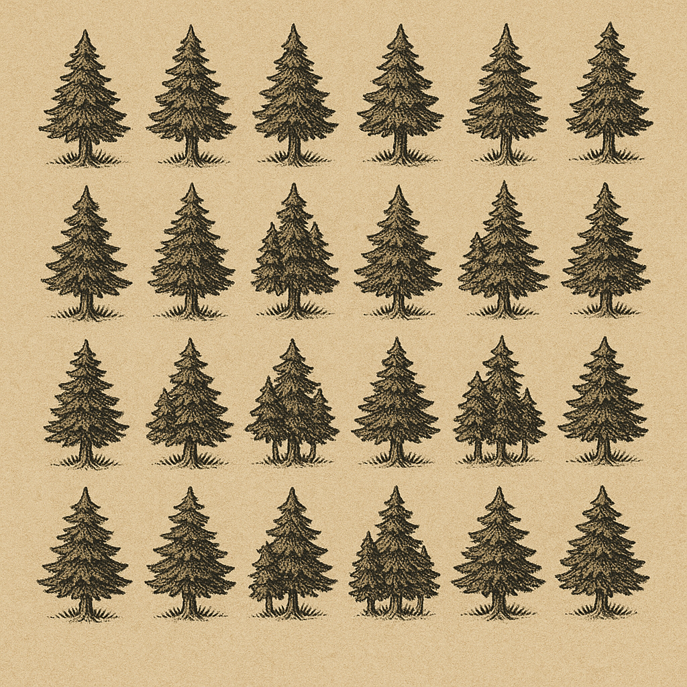
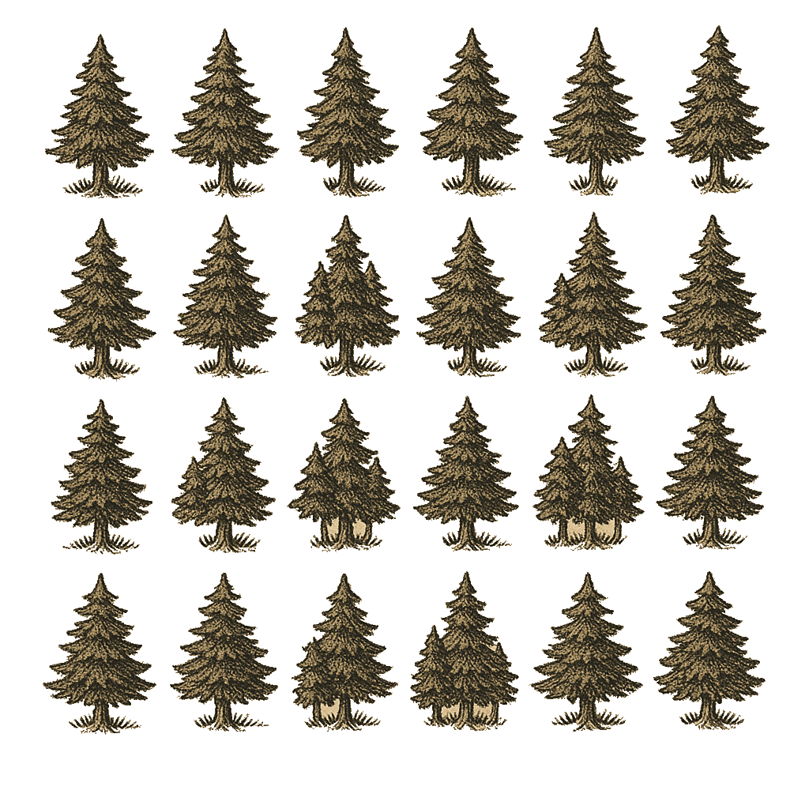
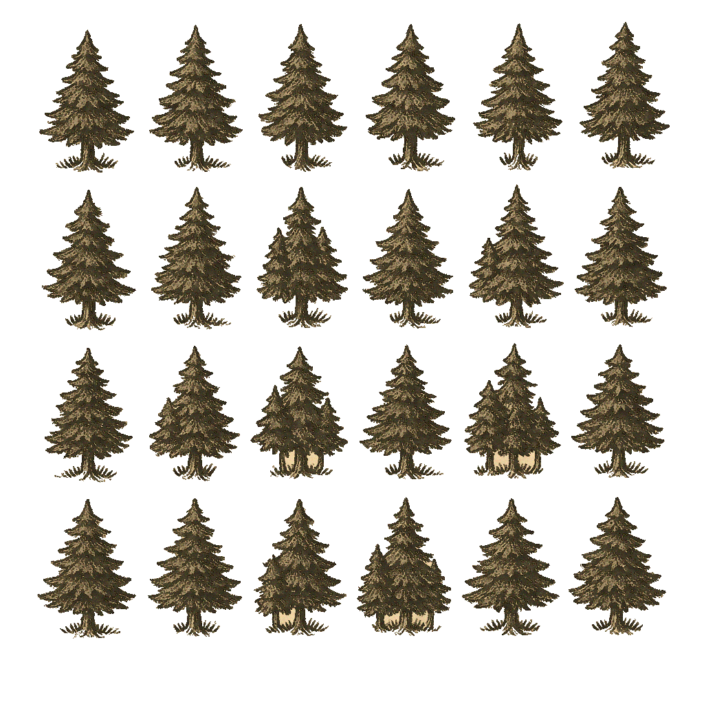
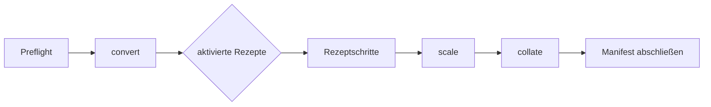

# Verarbeitungsprozess und Rezepte

Dieses Dokument beschreibt den zentralen Rezept-Graph. Die Abbildungen stammen
aus der Legacy-Pipeline und dienen als visuelle Orientierung; sie sind keine
pixelgenauen Regressionserwartungen.

## Ausgangsbild

Nach dem Import liegt jedes unterstützte Bild als PNG/RGBA im Arbeitsverzeichnis
des aktuellen Runs. Originaldateien bleiben standardmäßig an ihrem Eingabeort.

## Transparenz

Die Stufe `transparency` ermittelt den Hintergrund und schreibt einen expliziten
Alpha-Kanal.

## Enhancement

`enhance` quantisiert Farben, abstrahiert Flächen, betont Kanten und kann ein
reproduzierbares, durch `random_seed` gesteuertes Papierkorn ergänzen.

## Standardrezepte

| Rezept | Interne Schritte | Zweck |
| --- | --- | --- |
| `transback` | `transparency`, `extract` | transparente farbige Einzelobjekte |
| `enhancement` | `enhance`, `transparency`, `extract` | verbesserte farbige Einzelobjekte |
| `whitepaper` | `transparency`, `extract_gray` | Graustufenobjekte |
| `enhancwhite` | `enhance`, `transparency`, `extract_gray` | verbesserte Graustufenobjekte |
| `enhanclean` | `enhance`, `transparency`, `extract`, `cleanup` | verbesserte und bereinigte Farbausgabe |
| `transclean` | `transparency`, `extract`, `cleanup` | transparente und bereinigte Farbausgabe |
| `enhwhitclean` | `enhance`, `transparency`, `extract_gray`, `cleanup` | verbesserte und bereinigte Graustufenausgabe |

Die Standardkonfiguration aktiviert nur `transback`. Weitere Rezepte werden in
der Konfiguration aktiviert oder wiederholt über `--recipe NAME` ausgewählt.

## Beispielergebnisse

### Transback

### Transclean

### Enhancement

### Enhanclean

### Whitepaper

### Enhancwhite

### Enhwhitclean

## Ausführungsreihenfolge

Gemeinsame Schritte dürfen intern wiederverwendet werden, solange jedes Rezept
dieselben fachlichen Resultate erhält. Die sichtbare Ausgabe bleibt nach Rezept,
Skala und Run-ID getrennt.

## Extraktionsreihenfolge

Gefundene Konturen werden nicht in der zufälligen Reihenfolge einer Bibliothek
benannt. Die Pipeline sortiert räumlich von oben nach unten und innerhalb einer
Zeile von links nach rechts. Dadurch bleiben Dateinamen und Manifest auch bei
wiederholten Läufen stabil.

## Skalierung und Collation

`scale` erzeugt nur konfigurierte Größen. Sämtliche vorhandenen Verzeichnisse mit
dem Muster `xNN` werden von einer erneuten rekursiven Skalierung ausgeschlossen,
auch wenn die betreffende Größe inzwischen deaktiviert ist.

`collate` sammelt ausschließlich Ergebnisse des aktuellen Runs. Gleiche
Zielnamen werden gemäß `collision_strategy` behandelt und nie still
überschrieben.

## Was nicht mehr Teil der Steuerung ist

- kein „neuestes“ Datumsverzeichnis
- keine fest codierten Collation-Nummern in Stufen
- keine internen Python-Unterprozesse
- keine automatische Löschung nach der Extraktion
- keine wiederholten `filtered_`-Präfixe
- keine Abhängigkeit vom aktuellen Arbeitsverzeichnis

Weitere Details stehen in [architecture.md](architecture.md) und
[configuration.md](configuration.md).
